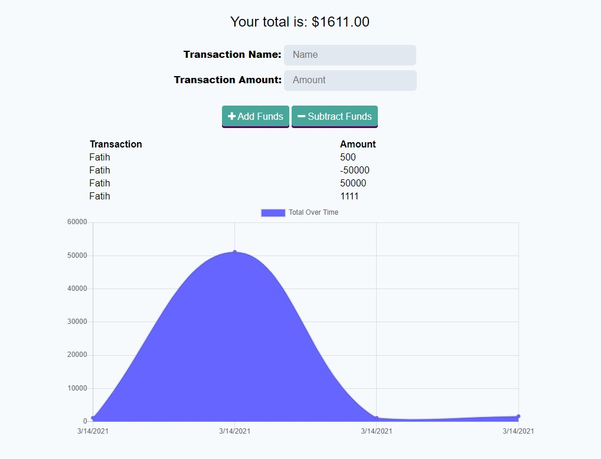

<h1 align="center", margin="2%">                       Online/Offline Budget Trackers </h1>

[][L]

[L]:https://opensource.org/licenses/MIT

<h1>Description</h1>

   The user will be able to add expenses and deposits to their budget with or without a connection. 
   When entering transactions offline, they should populate the total when brought back online.

<h1> Table of Contents </h1>

* [Demo](#Demo)

* [Installation](#installation)
  
* [Usage](#usage)

* [License](#license)

* [Deployed](#Deployed)

 
* [Questions](#Questions)

## Demo:

## Installation:
    1️⃣ Clone repository to your local ✔
    2️⃣ Run npm packages in (package.json) file ✔
    3️⃣ Run 'Node server' or 'npm start' to start application ✔
    
##  Usage:
    1️⃣ After running server ✔
    2️⃣ Enter name and transaction amount ✔
    3️⃣ Add Funds or Subtract Fund depends on needed ✔ 
    4️⃣ After transaction chart below will inform about the total amount by years ✔
    

##  License:
    This project is licensed under the MIT license.

    For more information about the license, click on the link below.

<h1>

  

©  [][M]

[M]: https://opensource.org/licenses/mit

</h1>

## Deployed:

[][H]

[H]: https://online-offline-budget-oo.herokuapp.com/

## Questions:
   
<h1 align="center">

     For questions ❓ 

[][1]
[][2]
[][3] 

[1]: https://github.com/fatihay53
[2]: https://www.linkedin.com/in/fatih-sultan-ay-211689181
[3]: mailto:f.sultanay@gmail.com

</h1>

